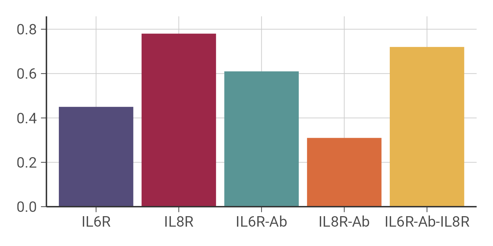
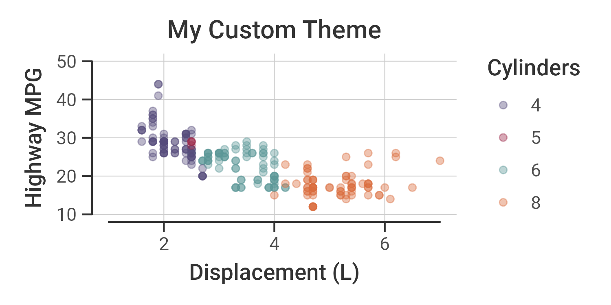

<!-- README.md is generated from README.Rmd. Please edit that file -->

# crthemes

<!-- badges: start -->

[](https://github.com/christyray/crthemes/actions)

<!-- badges: end -->

`crthemes` provides a standardized theme to use for my thesis project
figures. The goal is to write simple functions that can be applied to
all plots to make it as straightforward as possible to create
reproducible, consistent, beautiful visualizations.

The package comes bundled with a variety of color palettes name-matched
to the species in my thesis project models and a selection of open
source fonts.

## Installation

You can install the development version of crthemes from
[GitHub](https://github.com/) with:

``` r
# install.packages("devtools")
devtools::install_github("christyray/crthemes")
```

## Example

To apply the default theme to a plot, use `theme_cr()` in place of the
normal `theme()` function:

``` r
library(crthemes)
library(ggplot2)
p <- ggplot(mpg, aes(displ, hwy, color = as.factor(cyl))) +
  geom_point(alpha = 0.4) +
  labs(
    title = "My Custom Theme", 
    x = "Displacement (L)",
    y = "Highway MPG",
    color = "Cylinders"
  ) +
  theme_cr()

p
```


The `scale_*_cr()` functions apply colors from the custom palette to the
plot. The palettes can be listed with `pal_names()` and previewed with
`pal_preview()`. The palettes can be used with any plot, but they can
also be name-matched to my model output:

``` r
df <- data.frame(
    x = factor(c("IL6R", "IL8R", "IL6R-Ab", "IL8R-Ab", "IL6R-Ab-IL8R"),
               levels = c("IL6R", "IL8R", "IL6R-Ab", 
                          "IL8R-Ab", "IL6R-Ab-IL8R")),
    y = c(0.45, 0.78, 0.61, 0.31, 0.72))
p <- ggplot(df, aes(x, y, fill = x)) +
  geom_col(show.legend = FALSE) +
  scale_y_continuous(expand = expansion(mult = 0)) +
  scale_fill_cr(palette = "receptors", species = unique(df$x)) +
  labs(x = NULL, y = NULL) +
  theme_cr()
p
```



The `geom_rangeframe_cr()` function is a wrapper for
[`geom_rangeframe`](https://jrnold.github.io/ggthemes/reference/geom_rangeframe.html)
from the [`ggthemes`](https://jrnold.github.io/ggthemes/) package. It
allows for the limits of the range frame to be specified directly. The
`theme_rangeframe` theme is the version of my standardized theme
designed to be used with a range frame `geom`.

``` r
p <- ggplot(mpg, aes(displ, hwy, color = as.factor(cyl))) +
  geom_point(alpha = 0.4) +
  scale_color_cr() +
  labs(
    title = "My Custom Theme", 
    x = "Displacement (L)",
    y = "Highway MPG",
    color = "Cylinders"
  ) +
  geom_rangeframe_cr(xlim = c(1,7), ylim = c(10,50)) +
  coord_cartesian(clip = "off") +
  theme_rangeframe()
p
```



The `crsave` function saves the plots using sensible defaults for the
type of plot to be saved. There are also helper functions for bar graphs
and heat maps to better display the legends. More details on the
packages functions are available in the [package vignettes](vignettes).
